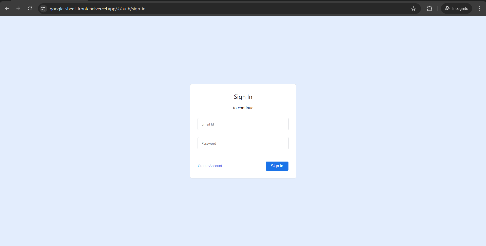
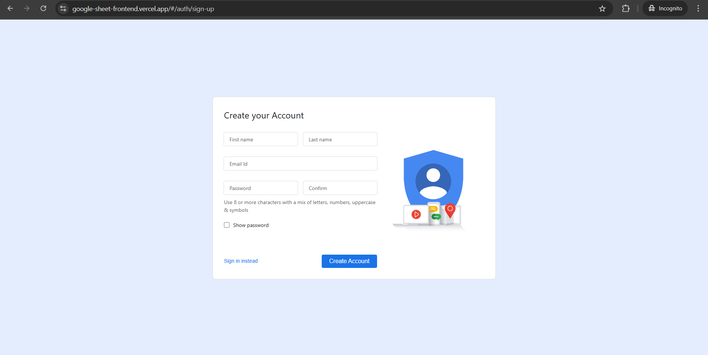
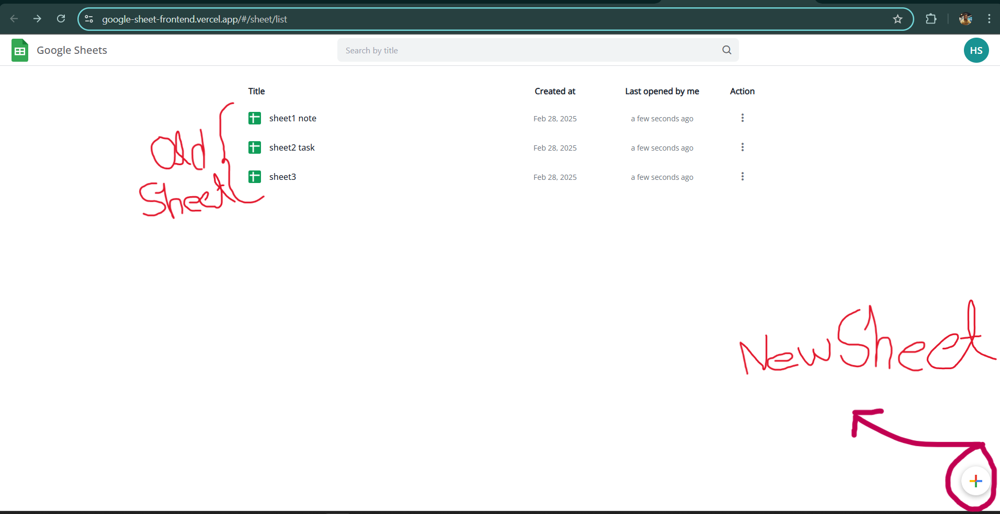
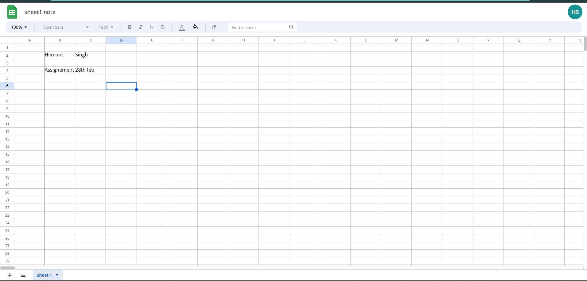

---

# Google Sheets Clone - Frontend  

**Live Demo:** [Google Sheets Clone](https://google-sheet-frontend.vercel.app/)  
**Repository:** [GitHub](https://github.com/hemantsingh0557/googleSheetFrontend)  

This is a **fully functional Google Sheets clone**, built using **React, TypeScript, and Vite**. It replicates **Google Sheets' UI and features**, providing a seamless, **high-performance spreadsheet experience** with **1000 rows and 26 columns (A-Z)**.  

---

## 🚀 Getting Started  

### 1️⃣ Clone the Repository  
```sh
git clone https://github.com/hemantsingh0557/googleSheetFrontend.git
cd googleSheetFrontend
```

### 2️⃣ Install Dependencies  
```sh
npm install
```

### 3️⃣ Run the Development Server  
```sh
npm run dev
```

### 4️⃣ Build for Production  
```sh
npm run build
```

---

## 🔐 Login & Registration  

As shown below, you can **log in or register** to access the platform:  

<p align="center">
  
  
</p>


---

## 📜 Sheet Management  

### **Main Dashboard**  
This is the **main dashboard** where you manage your sheets.  

- **Bottom-right corner:** Click the button to **generate a new sheet**.  
- **Continue Previous Work:** Open an existing sheet and pick up where you left off.  

<p align="center">
  
</p>


### **Sheet Editor**  
This is the **actual sheet editor**, where you will create and edit your spreadsheet.  


<p align="center">
  
</p>
---

## 📊 Features  

### **📄 Core Spreadsheet Functionalities**  
- **Real-Time Editing:** Modify any cell with instant updates.  
- **Auto-Update Formulas:** Changes in referenced cells automatically update results.  
- **Dynamic Resizing:** Drag to **resize rows and columns** for better visibility.  
- **Insert & Delete:** Add or remove rows/columns dynamically.  
- **Right-Click Context Menu:** Access quick actions on cells, rows, and columns.  
- **Selection & Navigation:** Click to select, use arrow keys, and multi-cell selection.  
- **Drag to Fill:** Autofill formulas and copy-paste values seamlessly.  
- **Find & Replace:** Locate and replace values across the sheet efficiently.  

### **🎨 Rich Formatting Options**  
- **Text Styling:** Apply **Bold, Italic, Underline**, and change **Font Size & Family**.  
- **Color Customization:** Modify background and text colors for better readability.  
- **Text Alignment:** Supports **Left, Center, and Right alignment**.  

### **⚡ Optimized Performance & UX**  
- **Handles Large Data Efficiently:** Renders **1000 rows smoothly** without lag.  
- **Custom Scrollbars:** Improves navigation in large datasets.  
- **Keyboard Shortcuts:** Perform actions quickly without using the mouse.  
- **Fast & Lightweight:** Built using Vite for optimized performance.  

---

## 🛠️ Tech Stack  

- **Frontend:** React, TypeScript, Vite  
- **State Management:** React Context API  
- **Styling:** SCSS, CSS Modules  
- **Utilities:** Axios for API calls  

---

## 📄 License  
This project is licensed under the **MIT License**.  

---
